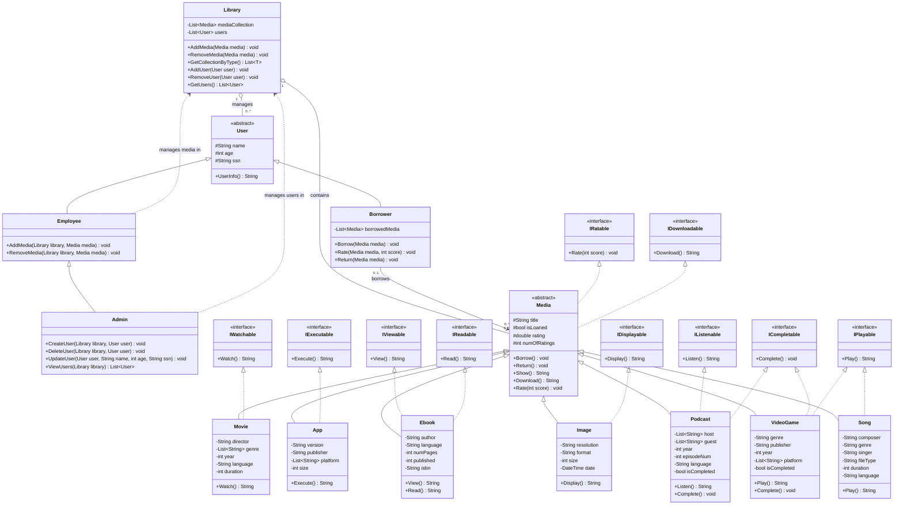

```mermaid
classDiagram
    class Library {
        -List~Media~ mediaCollection
        -List~User~ users
        +AddMedia(Media media) void
        +RemoveMedia(Media media) void
        +GetCollectionByType() List~T~
        +AddUser(User user) void
        +RemoveUser(User user) void
        +GetUsers() List~User~
    }

    class User {
        <<abstract>>
        #String name
        #int age
        #String ssn
        +UserInfo() String
    }

    class Borrower {
        -List~Media~ borrowedMedia
        +Borrow(Media media) void
        +Rate(Media media, int score) void
        +Return(Media media) void
    }

    class Employee {
        +AddMedia(Library library, Media media) void
        +RemoveMedia(Library library, Media media) void
    }

    class Admin {
        +CreateUser(Library library, User user) void
        +DeleteUser(Library library, User user) void
        +UpdateUser(User user, String name, int age, String ssn) void
        +ViewUsers(Library library) List~User~
    }

    class IRatable {
        <<interface>>
        +Rate(int score) void
    }

    class IDownloadable {
        <<interface>>
        +Download() String
    }

    class IWatchable {
        <<interface>>
        +Watch() String
    }

    class IExecutable {
        <<interface>>
        +Execute() String
    }

    class IViewable {
        <<interface>>
        +View() String
    }

    class IReadable {
        <<interface>>
        +Read() String
    }

    class IDisplayable {
        <<interface>>
        +Display() String
    }

    class IListenable {
        <<interface>>
        +Listen() String
    }

    class ICompletable {
        <<interface>>
        +Complete() void
    }

    class IPlayable {
        <<interface>>
        +Play() String
    }

    class Media {
        <<abstract>>
        #String title
        #bool isLoaned
        #double rating
        #int numOfRatings
        +Borrow() void
        +Return() void
        +Show() String
        +Download() String
        +Rate(int score) void
    }

    class Movie {
        -String director
        -List~String~ genre
        -int year
        -String language
        -int duration
        +Watch() String
    }

    class App {
        -String version
        -String publisher
        -List~String~ platform
        -int size
        +Execute() String
    }

    class Ebook {
        -String author
        -String language
        -int numPages
        -int published
        -String isbn
        +View() String
        +Read() String
    }

    class Image {
        -String resolution
        -String format
        -int size
        -DateTime date
        +Display() String
    }

    class Podcast {
        -List~String~ host
        -List~String~ guest
        -int year
        -int episodeNum
        -String language
        -bool isCompleted
        +Listen() String
        +Complete() void
    }

    class VideoGame {
        -String genre
        -String publisher
        -int year
        -List~String~ platform
        -bool isCompleted
        +Play() String
        +Complete() void
    }

    class Song {
        -String composer
        -String genre
        -String singer
        -String fileType
        -int duration
        -String language
        +Play() String
    }

    Library "1" o-- "0..*" Media : contains
    Library "1" o-- "0..*" User : manages

    User <|-- Borrower
    User <|-- Employee
    Employee <|-- Admin
    Borrower "0..1" --> "0..*" Media : borrows
    Employee ..> Library : manages media in
    Admin ..> Library : manages users in

    IRatable <|.. Media
    IDownloadable <|.. Media

    Media <|-- Movie
    Media <|-- App
    Media <|-- Ebook
    Media <|-- Image
    Media <|-- Podcast
    Media <|-- VideoGame
    Media <|-- Song

    IWatchable <|.. Movie
    IExecutable <|.. App
    IViewable <|.. Ebook
    IReadable <|.. Ebook
    IDisplayable <|.. Image
    IListenable <|.. Podcast
    ICompletable <|.. Podcast
    ICompletable <|.. VideoGame
    IPlayable <|.. VideoGame
    IPlayable <|.. Song
```
